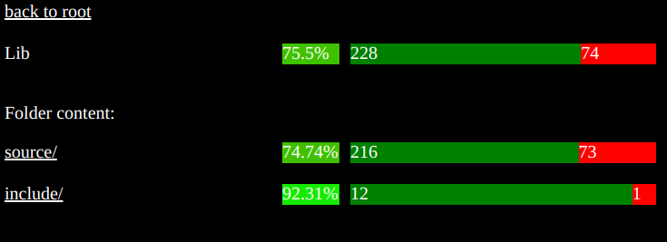

- [What is this library about](#intro)
- [Typical scenario](#scenarios)
- [Usage](#usage)



**Git** sources are available here: https://github.com/andreacasalino/PrettyGcov

This package can be also **pip** installed. Visit: https://pypi.org/project/PrettyGcov/  

## INTRO

Have you ever needed to process results coming from [**gcov**](https://gcc.gnu.org/onlinedocs/gcc/Gcov-Intro.html#Gcov-Intro) to check the coverage of **c++** projects?
Felt like you needed a tool to automatically gather, parse and process [**gcov**](https://gcc.gnu.org/onlinedocs/gcc/Gcov-Intro.html#Gcov-Intro) results?
Don't worry, you are in the right place as this package is what you are looking for :)!

**PrettyGcov** is a **python** package able to parse coverage results, compute statistics for the entire projects or any subfolder and let you inspect them from your browser.


## SCENARIOS

Haven't left a **star** already to the git project? Do it now ;)!

The typical scenario is that you have a **c++** projects, instrumeted in order to keep track of codes coverage by testing.
This is typically done by making use of [**gcov**](https://gcc.gnu.org/onlinedocs/gcc/Gcov-Intro.html#Gcov-Intro), which requires you to compile the code with special flags enabled (refer to the official [**gcov**](https://gcc.gnu.org/onlinedocs/gcc/Gcov-Intro.html#Gcov-Intro) documentation).
If your project is a **c++** project you would probably add to the root **CMakeLists.txt** something along the lines of this:
```cmake
SET(GCC_COVERAGE_COMPILE_FLAGS "-fprofile-arcs -ftest-coverage")
SET(GCC_COVERAGE_LINK_FLAGS "-lgcov --coverage")
set(CMAKE_CXX_FLAGS "${CMAKE_CXX_FLAGS} ${GCC_COVERAGE_COMPILE_FLAGS}")
set(CMAKE_EXE_LINKER_FLAGS "${CMAKE_EXE_LINKER_FLAGS} ${GCC_COVERAGE_LINK_FLAGS}")
```

Then you configure and compile all the tests that are part of your project. 
When compiling, some **.gcno** files will be generated and stored in the same place where compiled objects are.
Then, when running each test, or any other application consuming your instrumented library(ies), some **.gcda** files are generated/updated in order to keep track of the lines reached by the calling application.

**.gcda** are not human readable and you need to run the **gcov** command passing such files in order to generate **.gcov** files. These files contain all the coverage information that you need to inspect.

Generating and parsing **gcov** files can be tedious and time consuming. That's why this library does this for you!!

## USAGE

Haven't left a **star** already to the git project? Do it now ;)!

Suppose you have already compiled and run all the tests of a **c++** project. As explained in this [Section](#scenarios)), some **.gcda** files should be produced in the building folder of your project.

At this point you may want to use **PrettyGcov** to:

- A): generate a **python** object, storing the coverage results of each file that is part your **c++** project as well as each subfolder of it, which you may use in for any kind of purpose (generate reports, checking coverage threshold, etc...)

- B): visualize coverage results by exploiting a **python** webserver that allows you to navigate the results itself in your favourite browser.

For A), you can use a **CoverageMap** or a **CoverageTree**, by simply specifying the folder storing the sources of the project, where the **.h**, **.cpp** call it **SOURCE_FOLDER**, etc. files are, as well as the building folder (actually, only the root), where the **.gcda** files were generated call it **BUILD_FOLDER**.
To be more precise, a **CoverageMap** is a flat container of **GcovFile**(s), one for each spurce of the project. Each **GcovFile** store information about the percentage of covered lines and for each line it is possible to know whether:
    - it was covered
    - it was not covered
    - it is not coverable (the line is a comment or represent a class/function declaration, etc...)
A **CoverageTree** stores similar information, but also keeping the tree structure of the project. Indeed, each subfolder or file is a node of such a tree and for each node the coverage is available.
The python code that you need to write to get such data structures would be something like this:

```python
# tests should have been already run before calling this python script!

from PrettyGcov.CoverageMap import CoverageMap
from PrettyGcov.CoverageTree import makeCoverageTree

SOURCE_FOLDER='$PUT-HERE-THE-SOURCE-FOLDER'
BUILD_FOLDER='$PUT-HERE-THE-BUILD-FOLDER'

coverage_map = CoverageMap(BUILD_FOLDER)
coverage_map.addSourceDirectory(SOURCE_FOLDER)
coverage_map.generate()

# a tree is built from a map
coverage_tree = makeCoverageTree(coverage_map)

# so something with the map or the tree
```

Case B) is similar to A), with the exception that **ReportServer** will be used.
[WebServer.py](./PrettyGcov/WebServer/WebServer.py) is a stand alone script that can be run from python to initialize and run such kind of webserver. These options should be provided:
    - --port: the port the server should reserve (deafult value is 8080 but is strongly recommended to override it)
    - --gcov_root: actually the **BUILD_FOLDER**
    - --src_root: actually the **SOURCE_FOLDER**
you would run the application with something similar to this:

```bash
python3 $RELATIVE-PATH/WebServer.py --port 9500 --gcov_root $BUILD_FOLDER --src_root $SOURCE_FOLDER
```

suppose you have specified port=9500. After having run [WebServer.py](./PrettyGcov/WebServer/WebServer.py), you can paste in any browser the address 'http://localhost:9500/' to inspect the served results.
